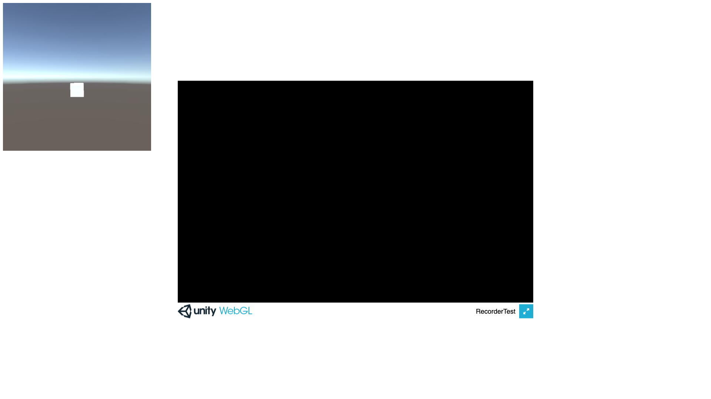

# Headless Unity Screen and Audio Recording

Headless mode is made possible for standalone build (i.e., windows, Mac, and Linux), through batch mode (`-batchMode`).

The web environment build (i.e., WebGL) is automated through `puppeteer`. Ideally, it will also be possible to make it work with audio, but **there is limited support for WebGL, as explained further below**.

In this test repository, everything is done locally, but the textures/images and audio could be sent to a server that is responsible for rendering them into video instead. Search for `SERVER` within `Assets/ScreenRecorder.cs` for that. The opposite is also valid: triggering the build in a server that replies with the rendered video.

## Setup
### Build
The first step is to build the project to the desired target. You can either do it manually through the Editor (**File > Build Settings > Build**), or through cli, as described in the subsections below.

To make it easier to access, in **standalone** scenarios, in case you opt for the cli, the resulting file will be saved to an automatically created `Build` folder. **Don't forget to `cd` to the project folder first.**

The **WebGl** build, in case you opt for the cli, will output it by default to `WebGl/Build`, and the textures will be saved into the persistent path, which is an **IndexedDB**.

**Before building the project to WebGL**, however, you should **disable** the `anti-aliasing` in unity's **quality settings**. If it is enabled, it will throw some OpenGL errors and the rendering will not work causing the output images to be black.

#### Windows x64
`$ "C:\Program Files\Unity\Editor\Unity.exe” -quit -batchmode -projectPath ./ -executeMethod BuildHelper.BuildWin64 -logFile buildLog.txt`

#### Windows x86
`$ "C:\Program Files (x86)\Unity\Editor\Unity.exe” -quit -batchmode -projectPath ./ -executeMethod BuildHelper.BuildWin -logFile buildLog.txt`

#### MacOS
`$ /Applications/Unity/Hub/Editor/2018.4.10f1/Unity.app/Contents/MacOS/Unity -quit -batchmode -projectPath ./ -executeMethod BuildHelper.BuildMac -logFile buildLog.txt`

#### Linux
Run the build resulting file as above, while setting `-executeMethod` to `BuildHelper.BuildLinux` or `BuildHelper.BuildLinux64` or `BuildHelper.BuildLinuxUniversal`

#### WebGL
Make sure to **disable** `anti-aliasing`, as described above, before running the following command:

`$ <unity-executable-or-app-path> -quit -batchmode -projectPath ./ -executeMethod BuildHelper.BuildWeb -logFile buildLog.txt`

Alternatively, if you want to automate the extra setup described next section, you can run the following instead:

`$ <unity-executable-or-app-path> -quit -batchmode -projectPath ./ -executeMethod BuildHelper.BuildWeb -logFile buildLog.txt && node WebGl/inject.js`

Or simply adapt `buildAndInjectWebGL.sh` to your needs, and execute it:

`$ bash ./buildAndInjectWebGL.sh`

### Run WebGl build

#### Extra setup
Before anything else, _if you rebuilt the WebGl build_, some extra code must be added to the `index.html` file within `WebGl/Build` folder, so that Unity can call a function from the client side. You can either do it manually, or by running a simple script that will do that for you.

##### Inject through script
Make sure to have `nodejs` installed and run:

`$ node WebGl/inject.js`

##### Manually
At the end of html tag `head`, add a reference to a new script:

``

At the beginning of `body`, add a new html element:

``

This script will run after 30 frames are stored into the IndexedDB, and will change the background (i.e., `testImage`) to the first captured image as a test, to see if everything is working.

#### Run build

To actually run the WebGL build in the browser, you will need a server. For instance:

`$ python -m SimpleHTTPServer 8080`

And open `http://localhost:8080/<path-to-WebGl/Build/>`

You should see something like below:

**Note that the screen of the game window will be black, because we are only concerned about running the project in headless/batch mode.**

#### Run with Puppeteer

The idea of using something like Puppeteer is to run the browser automatically and in headless mode, while still executing the build and recording the images.

##### Basic Setup

1. Install [NodeJS](https://nodejs.org/en/) (v10.18.1 or higher)
2. Install Yarn globally with `$ npm i -g yarn` or download it at their [website](https://yarnpkg.com/en/docs/install)
3. `$ cd WebGl && yarn` to install the dependencies.
4. `$ yarn server` to run a local server
5. `$ yarn start` to run the WebGL build through puppeteer

##### Expected results

The example is taking 2 screenshots after running for a few seconds (`WebGl/ScreenshotResults`). The resulting `renderingResult.png` should be the same as `expectedWebGLResult.png`.

It is also possible to run the WebGL build in **no-gpu** scenarios (e.g., a server). To do so, just uncomment `--disable-gpu` within `WebGl/main.js`.

### Run Build in Batch Mode (Standalone)

The project is prepared to run in batch mode through a coroutine that will save the first 30 frames to .bmp files to **Build/ScreenRecorder**.

#### Windows
`$ ./Build/AutomaticRecording.exe -batchMode -logFile batchLog.txt`

#### Mac
`$ sudo ./Build/AutomaticRecording.app/Contents/MacOS/AutomaticRecording -batchMode -logFile batchLog.txt`

### Video (with audio) Rendering

After getting the images and audio (either locally or remotely), it is possible to render them to video (e.g., `.mp4`) through something like **ffpmeg**. You can do so, for standalone builds, explicitly or through a simple script.

#### Explicitly
An example of that is to change to run:

`$ ffmpeg -y -r 30 -f image2 -s 1920x1080 -i "./Build/ScreenRecorder/frame%04d.bmp" -i "./Build/ScreenRecorder/audio_output.wav" -shortest -vcodec libx264 -crf 25 -pix_fmt yuv420p "./Build/ScreenRecorder/_video.mp4"`

By default, the name of the (presumably longer) audio file will be `audio_output.wav`. The video is cutoff when the images/frames end through the flag `-shortest` to make sure the audio matches correctly.

#### Script

Alternatively, you can simply execute `ffmpegRendering.sh`:

`$ bash ./ffmpegRendering.sh`

#### Run Build and Render video
You can also run the build and render the video right after (_you might need admin permissions_):

`$ ./Build/<executable-or-app-name> -batchMode -logFile batchLog.txt && bash ./ffmpegRendering.sh`

Or simply (_you might need admin permissions_):

`$ bash ./runBuildAndRender.sh`

#### Audio Recording limitation in WebGL
Unity3D relies on multiple threads to handle audio and mixing. Unfortunately, since WebGL platform does not support threads, the Audio API is limited and doesn't support `OnAudioFilterRead`, which is used (e.g., in standalone versions) to get the audio data while it is playing in runtime. More on this [here](https://docs.unity3d.com/Manual/webgl-audio.html).